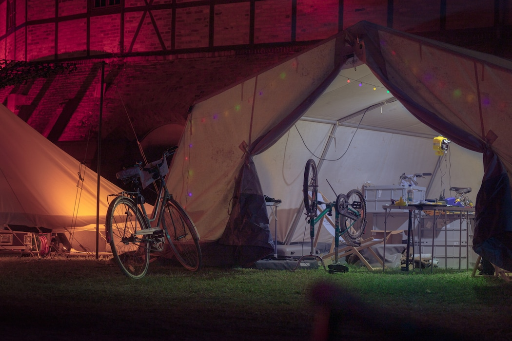
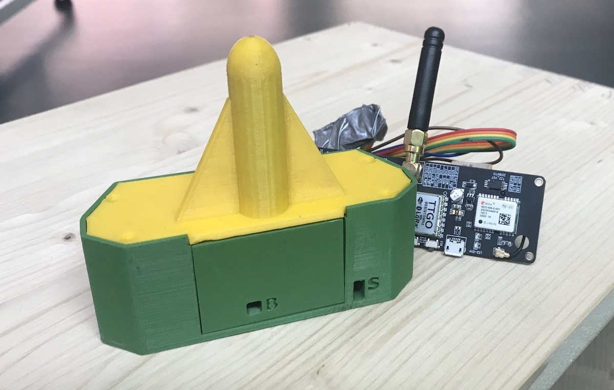

TL;DR: Es war [Chaos Communication Camp 2019](https://events.ccc.de/camp/2019/), wir machten Bikesharing.

<figure>
	
	<figcaption>
		
Bikesharing-Zelt, <a href="https://konkludenz.de/chaos-communication-camp-2019/">Konkludenz</a>

	</figcaption>
</figure>

Das alles entstand aus einer relativ fixen Idee. Am 19.6. haben wir uns [bei der Ministeriums-Fördervorstellung für die Stadt](https://twitter.com/digitalmobilBW/status/1141285450428145665) mit Yan von [Fahrgemeinschaft](https://www.fahrgemeinschaft.de/) getroffen, der uns am Rande der Veranstaltung anstiftete, Bikesharing auf dem Camp auszuprobieren. Eigentlich das fast perfekte Setting für so einen Versuch, denn das Camp ist zeitlich und räumlich beschränkt, der Rahmen relativ geschützt, und die NutzerInnenschaft ist eventuell etwas exzellenter zu den Bikes und auch am System selber interessiert.

## Wie wir das gemacht haben

Relativ kurzfristig. Am 1. August hatten wir eine erste [Projektseite im Camp-Wiki angelegt](https://events.ccc.de/camp/2019/wiki/Projects:Bikesharing), am 4. August folgte der [Aufruf über Twitter](https://twitter.com/radforschung/status/1158073193544015874), eigene (Schrotti)fahrräder mitzubringen, um sie ins System zu integrieren – ab dem Zeitpunkt hatten wir also noch 16 Tage Zeit, irgendetwas halbwegs funktionierendes auf die Straße zu bringen.

Und das funktionierte sogar besser als erwartet :D

[Consti](https://twitter.com/ubahnverleih) hatte es geschafft, in der woche vor dem Camp [eine Django-basierte Backendlösung](https://github.com/stadtulm/cykel) einfach so aus dem Boden zu stampfen. Wichtig dazu waren zwei Dinge: Erstens war total egal, ob man einzelne Punkte vielleicht irgendwie besser und weitsichtiger für einen späteren Ausbau ein halbes Jahr down the road machen könnte. Das System ist ausdrücklich als [MVP](https://de.wikipedia.org/wiki/Minimum_Viable_Product)-„Wegwerfsystem“ gedacht, um damit Erfahrungen zu sammeln. Und zweitens gab es in der Woche vor dem Camp schlicht keine Termine: Keine Besprechungen, keine Absprachen, niemand mit spontanen Nachfragen.

[stk](https://twitter.com/_stk) hat [den Code für TTN-Mapper auf Basis von TTGO T-Beams geforkt](https://github.com/radforschung/Lora-TTNMapper-T-Beam) um den Stromverbrauch noch etwas zu senken (insbesondere wird der GPS-Chipsatz in den Pausen schlafen gelegt). Ziel war, dass damit die Position der abgestellten Räder getrackt werden kann, ohne dabei zweimal am Tag die Akkus wechseln zu müssen. Wie viele andere ESP32-basierte Evaluationsboards hat der [T-Beam](http://tinymicros.com/wiki/TTGO_T-Beam) einige Designschwächen, so dass das Board _weit_ mehr als die theoretisch möglichen <1mA im Deep-Sleep-Modus verbraucht. Durch das Stillegen des GPS-Chips wird der Verbrauch aber immerhin von rund 90mA auf ca 15 mA gesenkt.

<figure>
	
</figure>

[robbi5](https://twitter.com/robbi5) tat derweil, was er am besten kann: Domains shoppen (die Ratio: Eine kurze Domain ist gut, damits Leute einfach auf ihrem Smartphone-Browser eintippen können), Deployments vorbereiten und durchführen, Schilder laminieren, Kisten packen und die ganze Nacht lang Bugs fixen.

<blockquote class="twitter-tweet">
was im übermüdeten zustand geht: ✅ domain shoppen  ❌ laminiergerät bedienen <a href="https://t.co/YOV6sNAONc">pic.twitter.com/YOV6sNAONc</a>
&mdash; robbi5 (@robbi5) <a href="https://twitter.com/robbi5/status/1162839090783563779?ref_src=twsrc%5Etfw">August 17, 2019</a></blockquote>

Eine Idee war zunächst, über QR-Codes gleich die Bike-ID einzubetten, das haben wir dann aber doch nicht gemacht, sondern einfach auf die Domain verwiesen. Ein nicht erwarteter Seiteneffekt: So eine hippe Domain wie [dev.bike](https://dev.bike) wurde von gar nicht mal so wenigen Leuten gar nicht als Domain interpretiert, sondern als Markenname oder sowas in der Art. Das bedurfte dann noch weiterer Erklärung.

## Und dann ging es los

Am Dienstag (20.8., Tag 0 vor dem offiziellen Campbeginn) machten wir den ersten Test mit dem Ausleihsystem: Einloggen, Rad-ID eingeben, Ausleihe beginnen. Nach und nach trudelten Fahrräder (und ein Rollstuhl!) bei uns ein, die viele liebe Menschen uns als Testobjekte mitgebracht hatten. Zeitgleich sorgte [vidister](https://twitter.com/vidister) dafür, dass unser mitgebrachtes [TTN](https://www.thethingsnetwork.org/)-Gateway auf den großen Kamin im Ziegeleipark gebaut und mit Netz versorgt wurde. Und so konnten wir testen. Bis irgendwann in der ersten Nacht die Akkus der Tracker leer liefen, weil wir die Batteriespannung anfangs nicht vernünftig übertragen haben.

<blockquote class="twitter-tweet">
&quot;Na, ist euer Bikesharing schon aktiv?&quot; - &quot;Ja,.. Aber wir haben das gleiche Problem wie alle Bikesharinganbieter: Wir wissen nicht, wo sie sind.&quot; - &quot;Ah, dann seid ihr ja hochgradig professionalisiert!&quot;
&mdash; vidister (@vidister) <a href="https://twitter.com/vidister/status/1164172372028645376?ref_src=twsrc%5Etfw">August 21, 2019</a></blockquote>

Das Batteriemonitoring und die Anzeige der letzten Funkmeldung der Tracker im Backend waren nur zwei von vielen Verbesserungen, die quasi kontinuierlich durch „oh shit!“-Momente und das Feedback der vielen TestnutzerInnen ins System einflossen. An der Stelle möchten wir uns auch ganz ganz herzlich bei den vielen vielen Menschen bedanken, die Tipps und Verbesserungsvorschläge zurückgemeldet haben; und darüber hinaus noch viel mehr bei allen, die aktiv auch Verbesserungen und Erweiterungen der Codebasis eingereicht haben. Dazu später noch mehr.

Für alle zeitkritischen Warnungen (z.B. „Fahrrad hat sich länger als eine Stunde nicht mit neuer Position gemeldet“ oder „Akkustand wird kritisch“) hatte robbi5 ab Tag 2 ein durchautomatisiertes Monitoring-System auf Prometheus-Basis ausgerollt, das uns per Nachricht informierte. In der Praxis sah das meist so aus, dass wir morgens von ganz vielen leeren Akkus erfuhren, falls nicht jemand zufällig vorher nachts eine Engelschicht hatte, die herumschlendern mit Akkutausch ermöglichte ;)

Weitere nach und nach integrierte Verbesserungen umfassten auch die Möglichkeit, sich über weitere Identitätsprovider am System anmelden zu können. Wir hatten bewusst darauf verzichtet, ein eigenes Benutzermanagement mit dev.bike-spezifischen Accounts zu verwenden, sondern setzten auf eine Anmeldung über [OAuth2](https://en.wikipedia.org/wiki/OAuth#OAuth_2.0). Anfänglich waren hier StackOverflow und Github als Identitätsprovider möglich; über die Zeit kamen [FragDenStaat](https://fragdenstaat.de/), EventPhone und zum Schluss Twitter als Loginmöglichkeiten dazu. [Mastodon](https://de.wikipedia.org/wiki/Mastodon) hätten wir gerne ebenfalls integriert, dort wird durch die Dezentralität der Login aber noch einmal eine Ecke komplizierter – auf _jeder_ Instanz müsste die OAuth2-App erst registriert werden. Das Mastodon-Projekt [hat das Problem bereits erkannt und vorgesorgt](https://docs.joinmastodon.org/api/authentication/); es gab aber zum Zeitpunkt der Camps noch [kein fertiges Django-Allauth-Plugin dafür,](https://twitter.com/radforschung/status/1164601303919714307) so dass wir diese Loginmöglichkeit erst einmal links liegen lassen haben.

<blockquote class="twitter-tweet">
Live in-Field debugging of cobbled together bikesharing tools :D <a href="https://twitter.com/radforschung?ref_src=twsrc%5Etfw">@radforschung</a> <a href="https://twitter.com/hashtag/CCCamp19?src=hash&amp;ref_src=twsrc%5Etfw">#CCCamp19</a> <a href="https://t.co/JrrQcVvmn7">pic.twitter.com/JrrQcVvmn7</a>
&mdash; stefan (@_stk) <a href="https://twitter.com/_stk/status/1164488082168655872?ref_src=twsrc%5Etfw">August 22, 2019</a></blockquote>

Witziger war die Eventphone-DECT-Login-Möglichkeit. Wer wollte, konnte die eigene DECT-Nummer eingeben und bekam dann eine Verifizierungs-Rufnummer und einen Zahlencode vorgelegt. Wer die Nummer anrief und die Nummer vorlas, wurde dann freigeschaltet – händisch, von wer auch immer in der Callgroup an die Nummer ging. Das gab natürlich Abzüge in der B-Note ;D 

Das konnte aber natürlich nicht so bleiben, deswegen bauten [Stefan Wehrmeyer](https://stefanwehrmeyer.com/) einen [automatisierten Auth-Workflow](https://github.com/stefanw/eventphoauth) und [Teal Starsong](https://twitter.com/moeffju) das [komplette Aussenrum](https://github.com/moeffju/devbike-eventphone-auth/) auf deutsch, englisch, spanisch, finnisch, japanisch und niederländisch. Wer also zukünftig auf einem Congress irgendwas mit Eventphone-DECT-Login haben will, dürfte nun eine passende Grundlage haben ;)

<blockquote class="twitter-tweet">
Just added my cargo bike to the <a href="https://twitter.com/radforschung?ref_src=twsrc%5Etfw">@radforschung</a> network at <a href="https://twitter.com/hashtag/cccamp19?src=hash&amp;ref_src=twsrc%5Etfw">#cccamp19</a> - try it out: <a href="https://t.co/LYxUJEAgwI">https://t.co/LYxUJEAgwI</a> - it is bike 14 <a href="https://t.co/FlrtMHPr4c">pic.twitter.com/FlrtMHPr4c</a>
&mdash; ligi 🖖☮️🌍🚲🌳🍵🎶🌶🔥 (@mr_ligi) <a href="https://twitter.com/mr_ligi/status/1164519147927220224?ref_src=twsrc%5Etfw">August 22, 2019</a></blockquote>

Auf der Fahrradseite kamen nach und nach mehr Fahrzeuge dazu. Der uns vorbeigebrachte Rollstuhl wurde relativ schnell für jemand mit lädierten Knöchel dauer-verliehen, um das Camp halbwegs zugänglich zu machen. Dafür kam ein Lastenrad dazu, das rege genutzt wurde, und spontan wurde auch [ein recht hochwertiges Rad in den Pool aufgenommen](https://twitter.com/LucasWerkmeistr/status/1164497617671376899). Dort zeigte sich dann auch gleich ein Problem: Wir kamen nicht schnell genug dazu, einen Tracker an dieses Rad zu bauen – schwupps war es bereits ausgeliehen, was dann [zu einer Suchaktion](https://twitter.com/radforschung/status/1164635007882878989) führte, bis dieses Rad (wie alle anderen zeitweise verlorenen) [durch Hinweise](https://twitter.com/SvenLakemeier/status/1164862239310065665) wieder gefunden wurde.

## Was wir alles gelernt haben

Anders als wir ursprünglich dachten, wurden die Fahrräder gar nicht so arg viel für Fahrten _auf_ dem Camp verwendet. Das passierte zwar (und meist auch ohne offizielle Ausleihen, und ohne dass die Schlösser benutzt wurden), war aber vor allem aufgrund der fehlenden Beleuchtung nachts eher schwierig. Gerüchten zufolge wurden einige Fahrten durch das [CERT](https://cert.ccc.de/wiki/index.php?title=Hauptseite) und den Himmel aufgrund der damit verbundenen Verkehrsunsicherheiten unterbunden.

Viel praktischer waren die Räder dagegen für Fahrten nach „draußen“, nach Gransee oder Zehdenick zum Einkaufen, an die Geldautomaten dort oder zu den umliegenden Seen. Dafür waren die Zahlenschlösser auch vollkommen ausreichend.

Wir haben absichtlich eine unbegrenzte Anzahl an gleichzeitigen Ausleihen pro NutzerIn ermöglicht. Das hat in der Praxis zu mehreren Dauer-Ausleihen geführt: Die Räder waren ausgebucht, standen aber ungenutzt in der Gegend herum, und da mit der Ausleihdauer keine Kosten verbunden waren, gab es auch keinen Anreiz für die Nutzenden, die „Miete“ zu beenden. Im unpraktischsten Fall lief dann dabei der Akku leer, so dass die Räder erstmal im System verschwunden waren, bis wir die Miete zwangs-beendet und die Räder wieder eingesammelt hatten. Hier wären sowohl ein Push-Hinweis bei Dauermieten sowie ein Rückkanal für Nachfragen praktisch – über eine Registrierung per DECT wäre das beispielsweise gegeben gewesen.

Die DECT-Callgroup auf die Rad-Schilder zu drucken hat sich dagegen als sehr praktisch erwiesen. So konnten wir anrufenden Interessierten erklären, dass sie die Räder per Browser ausleihen konnten, wohin „gefundene“ Räder gebracht werden sollen, oder einfach nur Feedback oder gar Lob entgegennehmen.

## Was uns sehr beeindruckt hat

Das Camp-Umfeld war der perfekte Testfall für unseren kleinen MVP-Rollout. Es hatte sich sehr schnell eine kleine Community von Menschen gebildet, die zum Gelingen des Systems beitragen wollten, und bei denen wir uns sehr sehr herzlich bedanken wollen:

* [vidister](https://twitter.com/vidister), der mit dem c3noc das Gateway online gebracht hat – letztlich eines von knapp 8 LoRa-Gateways auf dem Gelände
* [Teal](https://twitter.com/moeffju), [ex](https://twitter.com/Exmatrikulat0r), [stefanw](https://twitter.com/stefanwehrmeyer), [dome](https://twitter.com/0x530302/) für die Codebeiträge, unter anderem einen [Pull-Request, um auch stationsbasiertes Sharing in unserem MVP-System zu ermöglichen](https://github.com/stadtulm/cykel/pull/10)
* Alle, die Fahrzeuge beigesteuert haben. Es ergab sich auch recht schnell, dass Menschen auch gerne eine Fahrradreparaturstation gehabt hätten. Wir haben so gut geholfen, wie wir das konnten – ex hat aber bereits vorgesorgt und ein [c3bike](https://twitter.com/c3bike) für das nächste Mal initiiert :)
* Überraschenderweise tauchten die Räder auch irgendwann auf [der offiziellen Camp-Karte](https://map.events.ccc.de) als neuer Layer auf – da wir natürlich brav die Verfügbarkeit standardkonform im GBFS-Format veröffentlicht haben, [konnte russs die Daten dort integrieren](https://twitter.com/russss/status/1164991857086144514), was uns auch gleich einen praxisnahen Lasttest ermöglichte. Die 30 Anfragen pro Sekunde haben unser Testsystem zutiefst gelangweilt ;)

Außerdem: 

* Uns ist keine einzige Antenne der Tracker abgebrochen
* Alle Räder wanderten am Schluss wieder zu ihren EigentümerInnen
* Wir bekamen viele interessierte Nachfragen und konnten auch Testhardware für die weitere Entwicklung eines noch besseren offenen Verleihsystems an interessierte Spaces verteilen
* [Philipp](https://twitter.com/bockph) hat uns am letzten Tag noch [einige](https://twitter.com/radforschung/status/1165633307452813312) [Auswertungen](https://twitter.com/radforschung/status/1165631784211701760) [gebaut](https://twitter.com/bockph/status/1166090802189275136) – nächstes Mal denken wir eventuell früher daran :D

## Was als nächstes kommt

Einige Erkenntnisse haben es bislang noch nicht wieder ins System geschafft. Der Tracker hat – neben der viel zu stromhungrigen Hardware – noch einige Schwachstellen. Zum Einen sucht er noch viel zu häufig nach einem GPS-Fix, wenn das Rad sich eigentlich gar nicht bewegt hat – das hoffen wir mit einer passenden Accelerometer-Routine eingrenzen zu können. Und natürlich sollte perspektivisch auch eine bessere Hardwareplattform und die bessere Ausnutzung der FreeRTOS-Möglichkeiten mit dazukommen. Nicht zuletzt sollte bei leerlaufendem Akku noch eine „Last Will“-Nachricht mit letzter Standortbestimmung abgeschickt werden.

Im Backend gibt es derzeit noch keine Location-History, anhand derer man „verloren gegangene“ Räder gegebenenfalls aufspüren könnte. Die Daten dazu sind prinzipiell vorhanden; wir möchten irgendwann demnächst mit diesen Daten noch geeignete Auffinde-Möglichkeiten retrospektiv testen.

Außerdem sollen [Backend](https://github.com/stadtulm/cykel), [TTN-Adapter](https://github.com/stadtulm/cykel-ttn), [Frontend](https://github.com/stadtulm/gbfsmap) und [Trackersoftware](https://github.com/radforschung/Lora-TTNMapper-T-Beam) noch besser dokumentiert, Installationsanleitungen veröffentlicht und passende produktionsfähige Container gebaut werden, damit auch ihr damit arbeiten könnt. Dazu soll auch eine standardkonforme [MDS](https://github.com/CityOfLosAngeles/mobility-data-specification)-Schnittstelle kommen – weil es geht, weil wir mit gutem Beispiel vorangehen möchten, und weil wir für das weitere Verständnis und zukünftige Anregungen zur MDS selber auch die Provider-Sicht kennenlernen möchten.

Nicht zuletzt möchten wir auch noch mehr Austausch mit euch allen da draußen, die ihr euch für Freies/Open Source Bikesharing interessiert. Das Camp hat gezeigt, dass das funktioniert und dass es Einzelpersonen und Spaces gibt, die daran weiterarbeiten wollen. Wir haben Material und Mittel, euch mit Entwicklungshardware (Tracker-Prototyp und Schloss-Hülle) auszustatten – mehr dazu folgt in Kürze, wenn wir soweit sind.

Und ganz zum Schluss: Ein riesiges Dankeschön an alle, die egal auf welche Weise mitgemacht haben, und großes Sorry an alle, die wir in diesem Artikel namentlich zu erwähnen vergessen haben. Ihr seid awesome :)

_Offenlegung: Die Entwicklung des Freien/Open-Source-Software-Bikesharing-Systems OpenBike wird derzeit vom Verkehrsministerium Baden-Württemberg gefördert; robbi5 und Consti entwickeln das System in diesem Rahmen seit 1.9. als Fellows der Stadt Ulm weiter._

