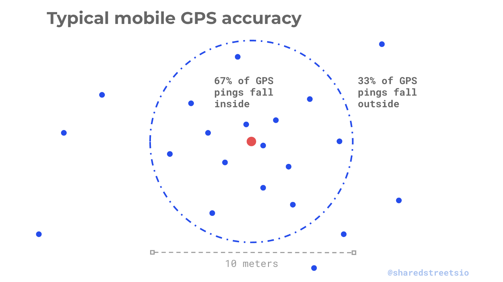
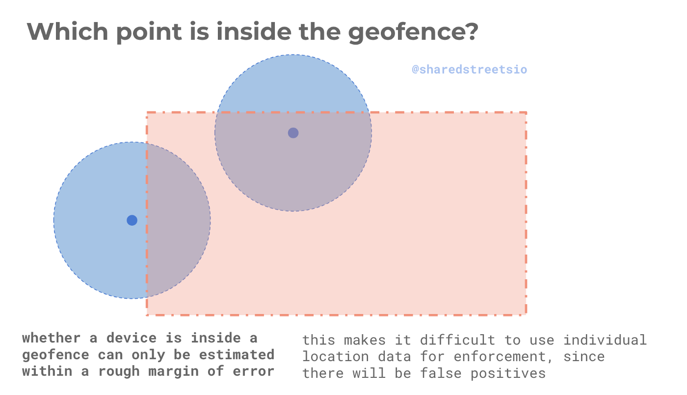

~~Wir haben 100 Kommunen gefragt, nennen Sie uns Ihren Umgang mit Scootersharern…~~

<figure>
	
	<figcaption>
		
<a href="https://commons.wikimedia.org/wiki/User:Fastily">FASTILY</a>, <a href="https://commons.wikimedia.org/wiki/File:Bird_Scooters_1_2018-09-28.jpg">Bird Scooters 1 2018-09-28</a>, <a href="https://creativecommons.org/licenses/by-sa/4.0/legalcode" rel="license">CC BY-SA 4.0</a>

	</figcaption>
</figure>

Nachdem die ersten E-Scooter-Sharer bereits ihre Dienste in deutschen Großstädten ausgerollt haben, erreichen uns immer wieder Fragen zu Details rund um die [Mobility Data Specification (MDS)](/log/mds-fuer-kommunen-erklaert/). Wir haben einmal versucht, die wichtigsten Fragen aus Kommunalsicht zu beleuchten. 

Diese Liste ist nicht abgeschlossen und wird sich erweitern[^changelog], sobald weitere Fragen bei uns ankommen. Von daher: [schickt uns weitere Fragen gern per Mail](mailto:hallo@radforschung.org)!

## Allgemeine Fragen

### Warum soll ich überhaupt regulieren? Warum soll ich mich damit beschäftigen?

Das ist eine gute Frage. Manche Städte reagierten in Stellungnahmen eher verschnupft. Die Stadt Frankfurt ist gar der Ansicht, dass sie Scooter total uninteressant finden, gar keine Scooter haben wollen und sich deswegen [gar nicht erst damit beschäftigen wollen](https://www.frankfurt.de/sixcms/detail.php?id=2855&_ffmpar[_id_inhalt]=35421165). Das _kann_ man natürlich so sehen – die deutsche Verwaltung wird sicher noch länger Bestand haben als der nächste Mobilitäts-Hype.

Wie so oft hilft als Gedankenexperiment, die Fragestellung umzudrehen: Wieso sollte man _nicht_ regulieren und sich _nicht_ damit beschäftigen? Momentan besteht die Möglichkeit, die bei einigen Anbietern schon vorhandenen, durchspezifizierten und erprobten Schnittstellen einfach zu benutzen. Das tut nicht weh und erlaubt es, den Prozess zu begleiten – und zwar nicht erst, wenn die in manchen Artikeln heraufbeschworenen Haufen an Rollern irgendwo Zufahrten zustellen.

Aus einer Verwaltung, die nur dann reagiert, wenn es sein muss, kann so eine _gestaltende_ Verwaltung werden, die neue Mobilitätsmodi bei ihrer Einführung begleitet und in der Lage ist, schnell und flexibel auf Erkenntnisse zu reagieren. Darin könnte man tatsächlich schon einen Wert für sich sehen.

### Wie soll ich denn regulieren? Da gibt es doch gar keinen Gesetzesrahmen?

Tatsächlich würde es derzeit schwierig werden, aufgrund bestehender gesetzlicher Rahmenbedingungen eine tatsächliche _Regulierung_ zu gestalten. Und vielleicht ist es dazu auch noch gar nicht der richtige Zeitpunkt. Man kennt das vielleicht von anderen Verwaltungsprozessen: Eine Arbeitsgruppe findet sich, trifft sich viermal, dann müssen noch Hinz und Kunz einbezogen werden, der gemeinsame Termin klappt nicht, die Outlook-Einladung geht verloren, nach der fünften Abstimmungsrunde ist das anfangs kleine Papier auf 14 Seiten angewachsen und wird langsam aber sicher zu einem Monster, das komplett jenseits der beabsichtigten Wirkung unterwegs ist.

Was stattdessen sofort funktioniert: Einfach mal _Wünsche_ an die Anbieter aussprechen. Vielleicht erfüllen sie die ja. Obwohl sie es gar nicht müssten. Und die Erkenntnisse dieser ersten Proberunde – sagen wir einmal 6 Monate – können dann bei Bedarf (und nur dann!) in eine tatsächliche Satzung oder andere „echte“ Regulierung einfließen.

Der magische Trick hier: Eine **Minimum Viable Policy.** Die kleinste, un-umfangreichste, nicht alles abdeckende Regelung, um nun die nächsten Schritte _auf dem Weg zu einem möglichen Ziel_ gehen zu können. Denn das konkrete, alle städtischen Interessen unter einen Hut bringende Ziel wird sich erst im Lauf dieser Reise herausstellen. Auf Basis dieser Erkenntnisse können später informierte und fundierte Entscheidungen folgen.

## Service Areas (Ausschluss- und Wunschzonen) über die MDS

### Was sind diese Areas/Zonen?

Das [Los Angeles Department of Transportation](https://ladot.io/) (LADOT, eine Mischung aus Verkehrsunternehmen und Verkehrsbehörde in Los Angeles) hat in der MDS ein Datenformat standardisiert, [über das sogenannte `Service Areas` definiert werden](https://github.com/CityOfLosAngeles/mobility-data-specification/blob/master/agency/README.md#service-areas). Hier können über eine Schnittstelle – im Zweifel individuell für jeden Mobilitätsanbieter – Gebietsumringe ausgespielt werden, die bestimmte Parameter haben.

Die Service Areas können dabei [**einen** von vier verschiedenen Typen](https://github.com/CityOfLosAngeles/mobility-data-specification/blob/master/agency/README.md#area-types) haben:

 * `unrestricted` – Gebiete, in denen die Fahrzeugmiete ohne Einschränkungen begonnen und beendet werden darf. Hiermit könnte künftig beispielsweise einem Anbieter ein bestimmtes Gebiet zugewiesen werden.
 * `restricted` – in diesem Gebiet sind Mietbeginn und vor allem Mietbeendigung nicht erlaubt. Dementsprechend können hier keine Roller abgestellt werden.
 * `preferred_pick_up` – hier soll der Anbieter bevorzugt Fahrzeuge für die Nutzerïnnen vorhalten. In der Regel geschieht dies durch Umverteilung der Fahrzeuge z.B. nachdem sie über Nacht von den „selbständigen Aufladepartnerïnnen“ geladen wurde.
 * `preferred_drop_off` – dort sollen Fahrzeuge bevorzugt beim Miet-Ende abgestellt werden. In der Regel ist dies so gelöst, dass die Nutzerïnnen einen finanziellen Anreiz wie z.B. eine Gutschrift erhalten, wenn sie die Miete an diesem Ort beenden.

### Warum soll ich überhaupt Service Areas nach MDS definieren? Ich kann doch auch einfach eine Karte malen, oder das mündlich angeben?

Die Übermittlung der Service Areas in einem maschinenlesbaren Format sorgt dafür, dass es *eine* offizielle Quelle gibt, an welcher Stelle das Abstellen von Fahrzeugen erlaubt ist und an welcher nicht.

Unserer Kenntnis nach bieten viele Anbieter derzeit an, auch beliebige andere Kartendarstellungen in ihr Hintergrundsystem zu übernehmen – von einer mündlichen Beschreibung bis zu einer ausgedruckten und von Hand schraffierten Karte.

<blockquote class="twitter-tweet">
Wichtiges <a href="https://twitter.com/hashtag/eScooter?src=hash&amp;ref_src=twsrc%5Etfw">#eScooter</a> Geofencing von <a href="https://twitter.com/limebike?ref_src=twsrc%5Etfw">@limebike</a>, <a href="https://twitter.com/CircMobility?ref_src=twsrc%5Etfw">@CircMobility</a> und <a href="https://twitter.com/TierScooter?ref_src=twsrc%5Etfw">@TierScooter</a> in <a href="https://twitter.com/Koeln?ref_src=twsrc%5Etfw">@Koeln</a>. Unterschiede sind erkennbar... <a href="https://t.co/7IPASw3UIj">pic.twitter.com/7IPASw3UIj</a>
&mdash; Jan Strehmann (@jstrehmann) <a href="https://twitter.com/jstrehmann/status/1143084944387956736?ref_src=twsrc%5Etfw">June 24, 2019</a></blockquote>

Solche Formate erlauben auf Seiten der Anbieter Spielraum für Interpretation – und am Ende sind die Nutzerïnnen mit einer Vielfalt von je Anbieter unterschiedlichen Ausschlusszonen konfrontiert.

Grundsätzlich *ließen* sich zwar je Anbieter verschiedene Gebiete festlegen. Es ist jedoch anzunehmen, dass das im oben dargestellten Beispiel gar nicht beabsichtigt war. Umso fataler wird dieser Effekt, wenn mit den `preferred`-Zonen Mobilitätsumschlagpunkte gemeinsam mit dem ÖPNV, Bikesharing etc. eingerichtet werden sollen. Hier sollten alle Anbieter am richtigen Platz landen. 

Das Ausspielen der Service Areas über eine offizielle, städtische Schnittstelle reduziert diesen Interpretationsspielraum. Und es erlaubt es, bei Änderungen oder Anpassungen allen Beteiligten sofort denselben neuen Datenstand zu übermitteln.

### Was, Änderungen? Wann kann ich Zonen denn ändern? Und wie oft?

Ja, genau. Die MDS erlaubt es, in einer Vereinbarung mit Anbietern nur auf den offiziellen Endpunkt (die „[API](https://de.wikipedia.org/wiki/Programmierschnittstelle)“) zu verweisen, über die die Service Areas ausgespielt werden. Was dort dann veröffentlicht ist, gilt. 

Theoretisch können die Wunsch- und Ausschlusszonen also täglich oder sogar noch häufiger geändert werden. Einzige *technische* Bremse ist, dass die Anbieter eventuell nur wenige Male am Tag einen Abgleich mit ihrem Hintergrundsystem machen – das haben wir noch nicht im Detail analysiert.

Wichtiger ist an der Stelle eher die *soziale* Bremse: Die Änderungen sollten aus Nutzerïnnensicht nicht ständig und willkürlich erscheinen.

### Warum sollte ich Zonen denn ändern können?

Wenn ein Marathon durch deine Stadt geht, möchtest du vielleicht nicht, dass Menschen direkt an der Marathonstrecke ihre Leihfahrzeuge abstellen. Dafür können Service Areas auch mit einer Gültigkeits-Anfangs- und Endzeit versehen werden.

In einer perfekten Welt würden passende maschinenlesbare Definitionen auch automatisch-magisch aus dem zugehörigen Fachverfahren herausfallen, wenn zum Beispiel eine verkehrsrechtliche Anordnung für eine Baustelle erlassen wird. Ohne dass jemand explizit etwas dazu tun muss.

### Was für geometrische Formen können die Zonen haben?

Die Umringe der jeweiligen Zonen sind sogenannte [GeoJSON-Multipolygone](https://tools.ietf.org/html/rfc7946#section-3.1.7) im [WGS84-Datum](https://de.wikipedia.org/wiki/World_Geodetic_System_1984). Das heißt, es können geometrische Formen aus beliebig vielen Linienzügen (jeweils ein Bleistiftzug ohne Absetzen) zu einem Gesamtpolygon gebaut werden.

[Mehr zu Multipolygonen und wie sie funktionieren ist hier im Verlauf der Seite erklärt.](https://gis.stackexchange.com/questions/225368/understanding-difference-between-polygon-and-multipolygon-for-shapefiles-in-qgis) Ob die Anbieter die Definition von Multipolygonen mit innenliegenden Begrenzungen (also „Löchern“ im Umring) alle korrekt interpretieren, ist uns derzeit nicht bekannt.

## Erste Schritte mit den Service Areas

### Womit sollte ich anfangen? Wie sollte ein erster Aufschlag für die Wunsch- und Ausschlusszonen aussehen?

Das ist eine sehr gute Frage, weil die Logik dieses Systems sehr anders aussieht als eine Regulierung der öffentlichen Hand normalerweise abläuft.

Wie weiter oben angerissen, sollte der erste Aufschlag eine **Minimum Viable Policy** sein. Das heißt, *das absolute Minimum* an `restricted`-Zonen und einige aktuell sinnvoll erscheinende `preferred`-Zonen.

*Das absolute Minimum* heißt: Nicht vorsorglich alles ausschließen, wo das Abstellen von Rollern zu einem Problem werden *könnte*. Sondern nur die Gebiete definieren, wo definitiv niemals auch nur ein Roller abgestellt werden darf. Alles weitere sollte danach zuerst einmal beobachtet werden – und *falls und wenn* strengere Einschränkungen notwendig sind, kann nachgezogen werden. Denn das ist ja jederzeit möglich.

Ein gutes Hilfsmittel zur Abschätzung, ob eine weitere Ausschlusszone für den ersten Aufschlag unbedingt notwendig ist, [ist die Frage passend zu stellen.](https://doist.com/blog/decision-making-flat-organization/) Die Frage ist nicht, „brauchen wir noch weitere Zonen?“ – denn dann gibt es *immer* irgendwen, die/der aus mehr oder weniger begründetem Anlass noch irgendeinen Bedarf konstruiert. Die Frage sollte sein „kann jemand *absolut nicht damit leben*, dass die Karte *im ersten Schritt* erst einmal so bleibt?“

### Wie zeichne ich die Zonen?

Für die Multipolygone wird im Standard GeoJSON als Format vorgeschrieben. Um dorthin zu kommen, sind mehrere Wege möglich und denkbar.

Die meisten GIS-Anwendungen speichern und tauschen ESRI-Shapefiles aus. Für die interne Bearbeitung in der Verwaltung kann das auch der passende Weg sein: Im GIS werden die Gebiete gezeichnet, die jeweiligen Fassungen ausgetauscht, und am Ende werden sie in die API eingespielt (mehr dazu im Software-Teil).

Gelegentlich werden bei solchen Prozessen Abteilungen oder Sachgebiete beteiligt sein, die selber keinen Zugriff auf GIS-Anwendungen an ihrem Arbeitsplatz haben. Hier kann zum Beispiel auf die kostenlose Webanwendung [GeoJSON.io](http://geojson.io) zurückgegriffen werden. Auf der Oberfläche können Polygone angelegt und bearbeitet werden. Die fertige Polygonsammlung kann dann als Shapefile oder GeoJSON heruntergeladen werden. Es wäre sogar möglich, die Ergebnisse in einem gemeinsamen [GitHub](https://de.wikipedia.org/wiki/GitHub)-Verzeichnis zu speichern, so dass mehrere Abteilungen die Daten bearbeiten und versioniert speichern können.

### Wie groß darf eine Zone sein? Kann ich … ausschließen?

Grundsätzlich sollte man erstmal betrachten, wie die Positionierung des Scooters funktioniert: Befindet sich ein Roller im öffentlichen Raum, nutzt dieser seinen verbauten GPS-Empfänger. GPS in solchen Geräten ist dazu noch viel ungenauer, als man es vom eigenen Smartphone her kennt - denn dort werden auch Mobilfunknetze, sichtbare Wifis und andere Positionierungsmöglichkeiten mit eingerechnet, um den eigenen Standort zu erhalten. 

<figure>
	
	<figcaption>
		
Q: <a href="https://medium.com/sharedstreets/using-location-data-for-guiding-micromobility-outcomes-fe72614d21a1">Morgan Herlocker, sharedstreets</a>

	</figcaption>
</figure>

Bei der Positionierung des Rollers, aber auch des Smartphones ist die Position immer noch auf grob 2 bis 15 Meter ungenau. Diese 2 bis 15 Meter sind wiederum selber nicht exakt! Tatsächlich wird diese Messungenauigkeit wiederum mit einem Konfidenzintervall von rund 67% angegeben. 

Das heißt folgendes: Nehmen wir an, ein Roller steht vollkommen still auf der Stelle und misst ständig die eigene Position. Das eingebaute GPS gibt dabei eine horizontale Genauigkeit von 10 Metern aus. In diesem Fall liegen 67% der Messwerte innerhalb eines 10-Meter-Kreises – und 33% der Messungen liegen irgendwo außerhalb.

Wenn der Scooter sich am Rand einer Zone befindet und sein Standort dank dieser Ungenauigkeiten durch die Gegend wandert - befindet er sich dann innerhalb oder außerhalb dieser Zone?

<figure>
	
	<figcaption>
		
Q: <a href="https://medium.com/sharedstreets/using-location-data-for-guiding-micromobility-outcomes-fe72614d21a1">Morgan Herlocker, sharedstreets</a>

	</figcaption>
</figure>

Die Begrenzung einer Zone ist praktisch gesehen keine genau definierte Linie, sondern es gibt eine „Knautschzone“ in beide Dimensionen, in denen manchmal das Abstellen außerhalb der Zone _nicht_ möglich ist und manchmal innerhalb der Zone _trotzdem_ Roller stehen könnten. Sehr kleine Ausschlusszonen wie z.B. genau ein Fahrbahntrenner funktionieren in der Praxis also nicht: Ist sie genau auf den Fahrbahntrenner definiert, wird sie häufig gar nicht wirken. Wird sie umso größer eingerichtet, nimmt sie ohne Not viel „Beifang“ auf vollkommen erlaubten und okayen Flächen weg.

Der Königsweg ist wie oben beschrieben zunächst nur das _absolut notwendige_ zu definieren und dann mit Praxisdaten zu arbeiten.

### Hä, wiewas, das ist doch Computer und Weltraumtechnik, und jetzt ist das ungenau?!

Ja, ganz genau (haha). Und das hat noch weitere Seiteneffekte. Wenn du die Auswertungen der MDS-Daten oder auch nur die Verfügbarkeit der Scooter in der jeweiligen App betrachtest, wird dir eventuell auffallen, dass Fahrzeuge vermeintlich in Ausschlusszonen abgestellt wurden. Oder auf Fahrbahnen. Oder in einem Fluss.

Und äh, das muss dann gar nicht unbedingt 1:1 wahr sein.

Genau wie bei den Zonen haben wir es auch bei den Statusdaten mit „unscharfen“ Dingen zu tun. Wir haben immer Messungenauigkeiten, und nur weil die Punkte auf der Karte sagen, dass hier ein Fahrzeug gemeldet wurde, heißt es nicht, dass es _exakt_ dort steht. Auch damit muss man umgehen und die Daten passend interpretieren können.

[Morgan Herlocker hat einen guten Text auf Englisch hierzu geschrieben](https://medium.com/sharedstreets/using-location-data-for-guiding-micromobility-outcomes-fe72614d21a1), aus dem wir auch die erklärenden Bilder der letzten Frage gemopst haben.

## Fortgeschrittenenübungen mit Service Areas

### Wie bringe ich die Zonendefinitionen zu den Anbietern?

Die sinnvollste Variante (und so ist es in der MDS auch gedacht) ist, sie an einer vorher definierten Stelle zu veröffentlichen. Theoretisch könnte man das auch in eine GeoJSON-Datei speichern und per E-Mail verschicken. Aber der eigentliche, richtige und auch für die späteren Prozesse sinnvollste Weg ist die Veröffentlichung.

### Wo und wie soll ich diese Zonendaten dann veröffentlichen

_Eigentlich_ müssten die Polygone über eine Programmierschnittstelle (API) über eine frei zugängliche, sich nie ändernde Webadresse ausgeliefert werden. Das heißt, wann immer der Server eines Anbieters (zum Beispiel) den API-Endpunkt `https://digitale-dienste.beispielstadt.invalid/mds/service_areas/` aufruft, bekommt er eine Liste aller Zonen mit den jeweils zugehörigen Metadaten[^1]. Also ob diese Polygone nun Ausschluss- oder Wunschzonen beschreiben, eine ID für die Service Area, optional Beginn und Ende der Gültigkeit, usw.

Blöderweise bräuchte man hierfür eine laufende Software für die standardisierte MDS-Schnittstelle. Wir gehen nicht davon aus, dass durchschnittliche kommunale IT-Prozesse in den nächsten Wochen mal eben nebenbei eine Virtuelle Maschine einrichten und eines der hierfür existierenden Systeme (z.B. [midas](https://github.com/polyconseil/midas)) ausrollen.

Behelfsweise könnte eine Kommune aber auch „einfach“ gemäß der MD-Spezifikation ein JSON-Objekt mit allen Zonen bauen und es an einer festen Stelle ablegen. Das heißt, dass (wieder z.B. auf `https://digitale-dienste.beispielstadt.invalid/mds/service_areas/`) ein statisches JSON abgelegt ist, wie es „normalerweise“ aus der MDS-API ausgeliefert werden würde.

Unglaublich wichtig ist an der Stelle, dass auf absehbare Zeit **immer** an dieser Stelle jeweils die aktuellste Service-Area-Definition zu finden ist. Immer am selben Ort. Nie an einer anderen Stelle oder mit aufsteigender Zählung im Dateinamen oder mit Datum oder sonstwas (ja, wir haben von 190702-ratsbeschluss-v6-final-kommentar2.docx gehört und das ginge auch anders und es tut ein bisschen weh ;D)

Was hier zum Beispiel auch theoretisch möglich wäre: `https://digitale-dienste.beispielstadt.invalid/mds/service_areas/` könnte per <nobr>[`HTTP 302`](https://en.wikipedia.org/wiki/HTTP_302)[^2]</nobr> auf eine beliebige andere Stelle verweisen, wo die Daten liegen. Hier wäre sogar denkbar, die Service-Area-Definitionen auf einer versionierbaren Plattform wie [Gitlab](https://de.wikipedia.org/wiki/GitLab) oder [Github](https://de.wikipedia.org/wiki/GitHub) zu veröffentlichen. So könnten mehrere Abteilungen gemeinsam die Daten bearbeiten und im Zweifelsfall eine frühere Version wiederherstellen. Eine [Arbeitsfassung solcher Zonen (nur die Geometrie, nicht die Metadaten) der Stadt Ulm](https://github.com/stadtulm/mds-zonen) ist tatsächlich auf Github findbar (wobei die Ausschlusszonen unserer Meinung nach für eine erste Fassung _viel_ zu restriktiv sind).

[^2]: Wir hätten hier gerne auf eine deutsche Erklärung verlinkt, aber in der deutschsprachigen Wikipedia gibt es leider keine detaillierte Beschreibung. [Nur in der bayerischen Wikipedia gibt es etwas](https://bar.wikipedia.org/wiki/HTTP_302). Das könnte für manche Lesende eine größere Hürde sein als die englische Variante, aber wir wollten das nicht unerwähnt lassen.

[^1]: Das stimmt in Wirklichkeit nur so halb. Tatsächlich muss der Betreiber sich der Schnittstelle gegenüber „ausweisen“. Wir haben das in dieser Fassung absichtlich etwas vereinfacht dargestellt – unserer Ansicht nach ist es durchaus denkbar und vielleicht auch sinnvoll, Ausschlusszonen auch öffentlich einsehbar zu machen.

### Kann ich solche Areas vielleicht auch bekommen, ohne dass ich händisch Polygone in Karten klicken muss?

Wir hatten das oben schon einmal angerissen: Perspektivisch fänden wir es _sehr_ spannend, wenn beispielsweise Straßensperrungen wegen einer Sportveranstaltung oder vergleichbare Prozesse _automatisch_ dazu führen würden, dass passende Service Areas angelegt und ausgespielt werden.

Wir haben uns sagen lassen, dass manche Fachverfahren wie z.B. Kommunalregie so etwas _grundsätzlich_ erlauben sollten (wobei sicherlich einiges an Anpassung notwendig sein dürfte). Aus unserer Sicht als Menschen aus der Informatik sollte eine moderne Verwaltung unbedingt (endlich) möglichst viele Gelegenheiten der Automatisierung nutzen. Dazu gehören Interoperabilität, offene und durchdefinierte Schnittstellen und Freie Software. Damit kommt man ziemlich sicher viel weiter als mit KI und Blockchain.

### Ohgottohgott, wie soll meine IT das mal eben einführen?

Ja, das ist eine Herausforderung. Du kannst dir auch die Frage stellen, inwieweit sich deine Verwaltung in den letzten 10 Jahren darum gekümmert hat, eine agile, flexible und motivierte IT-Abteilung auf technisch hohem Niveau aufzubauen. 

Denn: Die MDS ist jetzt _ein_ Beispiel. Die ist entstanden, weil LADOT mit [Seleta Reynolds](https://twitter.com/seletajewel) eine _hervorragende_, technisch versierte und visionäre Geschäftsführerin hat, die eine Strategie mit Weitblick zu haben scheint. In einer [fast eineinhalbstündigen Podcastfolge mit Adam Conover (englisch)](https://www.earwolf.com/episode/transportation-autonomous-cars-and-nerdy-commuter-fantasies-w-seleta-reynolds/) und [in einem Forbes-Artikel von ihr (ebenfalls englisch)](https://www.forbes.com/sites/seletareynolds/2019/06/26/why-cities-are-writing-their-own-standards-for-scooters-and-avs/#211f1d0a4252) lässt sich ihr Weitblick etwas erahnen.

Wir glauben und hoffen, dass Reynolds nicht alleine ist. Und dass in den kommenden Jahren weitere, ähnliche Konzepte entstehen werden. Die dann, wenn sie sinnvoll zum Einsatz kommen sollen, schnell und flexibel ausgerollt werden sollten. Ohne ein Jahr Vorlauf mit Ausschreibung. Mit schnellen Anpassungen auf die Gegebenheiten vor Ort.

Wenn die Antwort auf die Frage nach der flexiblen IT-Abteilung oben „nein“ war, wäre deswegen jetzt ein guter Zeitpunkt, etwas zu tun.

Ganz, ganz dringend.

[^changelog]: Changelog: https://github.com/radforschung/log/commits/master/content/post/mds-faq/index.md

