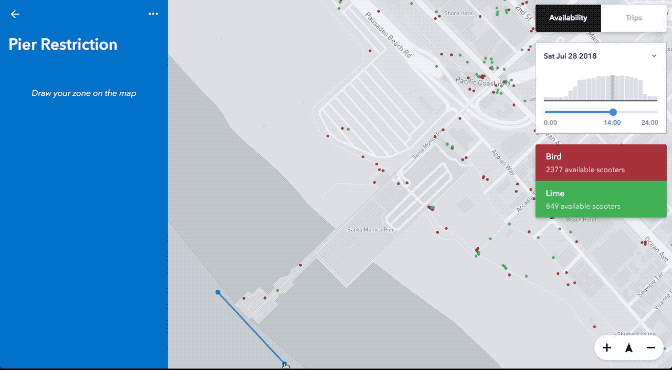
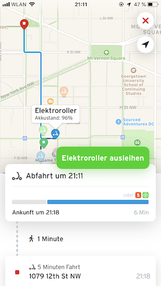
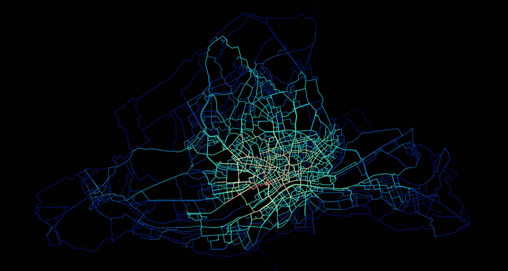

Bei der Suche nach Regulierungsmöglichkeiten von Bike- und Rollersharinganbietern fällt immer wieder der Begriff "MDS". Im [letzten Artikel](../rollersharing-was-staedte-lernen-koennen/) sind wir schon grundlegend darauf eingegangen, warum eine kommunale Regulierung von Fahrrad- und Rollerverleihdiensten wünschenwert ist.
Nun betrachten wir detaillierter die [Mobility Data Specification (MDS)](https://github.com/CityOfLosAngeles/mobility-data-specification) - eine technische Vorschrift zum elektronischen Austausch zwischen Bike/Scootersharing-Anbietern und Kommunen.

Um Chaos mit Fahrrad- oder Rollerverleihdiensten (wie z.B. mit oBike in München) zu vermeiden, ist ein Austausch zwischen den Anbietern und den Kommunen notwendig. Da wir uns im 21. Jahrhundert befinden und viele der Sharingunternehmen einen technischen Hintergrund haben, liegt es Nahe, den Austausch auf elektronischem Weg abzuhandeln. 
Da es hier auch um Informationen wie den Geodaten für Rollerparkverbote, die sich regelmäßig ändern können, geht, sollten diese Informationen nicht einfach telefonisch, per Fax oder E-Mail übertragen werden, sondern sollten vollständig maschinenlesbar sein. Um diesen Informationsfluss zu vereinheitlichen und zu vereinfachen wurde von mehreren Städten in den USA mit der [Mobility Data Specification (MDS)](https://github.com/CityOfLosAngeles/mobility-data-specification) ein Datenformat und Austauschprotokoll geschaffen. 

Die MDS besteht aus zwei Teilen. Zum einen den Daten, welche die Kommune bereitstellt und die Daten, welche die Sharinganbeiter bereitstellen. 

### Die Kommune:

#### Zonen

<figure>
  
  <figcaption>
    
Einfaches Erstellen von Zonen am Beispiel von <a href="https://www.remix.com/new-mobility">Remix for New Mobility</a>

  </figcaption>
</figure>

Die wahrscheinlich interessantesten Daten, welche eine Kommune bereitstellen kann, sind Verbotszonen.

Die meisten der neuen Sharing-Dienste haben keine festen Ausleih- und Abgabeorte. Die Fahrzeuge können, wie bei privater Fahrradnutzung auch üblich, überall abgestellt und wieder ausgeliehen werden und ermöglichen damit eine sehr flexible Mobilität. Die Leih-Roller (und mittlerweile auch ein Großteil der Leihräder) sind in der Regel mit intelligenten, GPS-verfolgten Schlössern ausgestattet. Dies ermöglicht den Anbietern das Abstellen der Roller auf bestimmten Gebieten zu verhindern. Das heißt, der Anbieter verbietet seinen Nutzern nicht nur das Abstellen in diesen Gebieten, es ist schlichtweg unmöglich die Miete eines Fahrzeugs an diesen Stellen zu beenden. Damit könnte diese Maßnahme effektiver sein als jedes offizielle Parkverbot. Da eine Stadt in der Regel besser weiß, an welchen Stellen keine Roller abgestellt werden sollten als der Anbieter, ist es auch im Interesse der Anbieter den Kommunen die Möglichkeit zu geben diese Zonen zu definieren.

Die Geo-Koordinaten der Zonen müssen dabei nicht Zentimetergenau sein, da auch das GPS der Roller die eigene Position nur auf etwa 5 Meter genau ermitteln kann. Dadurch sollte die Eintragung der Zonen mit den entsprechenden Werkzeugen auch nur eine Sache von Minuten sein. Eine gut ausgebaute Geodateninfrastruktur und Open-Data-Prozesse, damit passende Umringe als Vorlage auch von einer Nicht-Vermessungsabteilung schnell und einfach herangezogen werden können, sind hierfür Gold wert!

Natürlich ist es auch möglich Zonen temporär oder periodisch, z.B. für Veranstaltungen wie z.B. Wochenmärkte, Bauarbeiten oder Konzerte zu blocken. Dies kann bei lange voraus bekannten Veranstaltungen auch schon Monate davor passieren. Da die Kommunikation rein digital abläuft ist dies im Zweifel auch noch recht kurzfristig möglich.

Es geht aber nicht nur um Verbote: Gleichzeitig können auch Zonen definiert werden, an denen die Roller vom Anbieter bevorzugt in Umlauf gebracht werden sollen. Dies ermöglicht den Kommunen so regulierend einzugreifen, dass z.B. vom ÖPNV schlecht erschlossene Gebiete besser durch alternative Verkehrsmittel erschlossen werden.

Zudem können Zonen definiert werden an denen Nutzer die ausgeliehen Fahrzeuge bevorzugt zurückgeben sollen. Alle diese Zonen sind rein virtuell, es ist also keine zusätzliche Infrastruktur, Schilder oder Farbe auf der Straße notwendig.

Wichtig hier für die Denkweise in der Behörde: Anders als in der klassischen Verwaltungslogik funktionieren die Auschlusszonen in der Praxis *nicht* so, dass die Anbieter einen schriftlichen Erlass von der Stadt bekommen (am besten noch mit ausgedruckten Karten, in die die Zonen handschriftlich hineingemalt wurden), und abends laufen Angestellte des Anbieters mit einem dicken Ordner herum und machen den Vollzug. Sondern die Stadt übermittelt die Zonen als Geodaten, und unmittelbar danach funktioniert dort die Mietbeendigung nicht mehr.

### Der Anbieter:

Der Sharing-Anbieter selbst muss mit der MDS eine Menge Daten an die Kommune liefern, die für unterschiedliche Zwecke interessant sein können.

#### Fahrzeug-Registrierung

Nimmt der Betreiber ein neues Fahrzeug in Betrieb, registriert das System des Betreibers das Fahrzeug via MDS automatisch beim System der Kommune. Auch die Außerdienststellung, temporäre Deaktivierung (z.B. für Reparaturen) werden an das System der Kommune gemeldet. Somit behält die Kommune immer den Überblick welcher Anbieter wie viele Fahrzeuge auf Ihrem Gebiet im Einsatz hat. Somit kann z.B. eine mit Anbietern ausgehandelte Fahrzeugbegrenzung überwacht werden. Probleme wie mit oBike in München oder Zürich, bei denen oBike die Anzahl der aktiven Räder nicht nennen konnte oder wollte, können so verhindert werden.

#### Live-Standorte

Der Anbieter liefert die Standorte der Roller, die von Kunden ausgeliehen werden können, mit einer öffentlich zugänglichen Schnittstelle, die die Daten im Format der [GBFS (General Bikeshare Feed Specification)](https://github.com/NABSA/gbfs) ausgibt. Diese Daten können z.B. in lokale Nahverkehrsapps integriert werden um verfügbare Roller oder Leihräder im Umkreis anzuzeigen um auf der letzten Meile in Kombination mit dem ÖPNV genutzt zu werden. Offene ÖPNV-Auskunftsysteme wie [Digitransit](https://digitransit.fi/en/) oder [OpenTripPlanner](http://docs.opentripplanner.org/en/latest/) können diese Daten bereits in ein kombiniertes Routing mit einberechnen.

<figure>
  
  <figcaption>
    
Routenvorschlag mit einem Elektroroller in der <a href="https://transitapp.com">transit</a> App.

  </figcaption>
</figure>

#### Status-Änderungen

Die Anbieter stellen automatisiert Statusänderungen zur Verfügung, wenn z.B. ein Fahrzeug ausgeliehen, zurückgegeben oder vom Betreiber repariert, eingesammelt oder umgesetzt wurde. Damit lässt sich als Kommune kontrollieren, ob Gefährte an bestimmten Orten auch benutzt werden, oder ob diese dort tagelang, vielleicht sogar ohne Akkuladung, herumstehen.

#### Fahrten

<figure>
  
  <figcaption>
    
Bikesharing Heatmap aus berechneten Call-a-Bike Fahrten in Frankfurt am Main. Daten: CC-BY 4.0 <a href="https://data.deutschebahn.com/dataset/data-flinkster">Deutsche Bahn AG</a>, ODbL <a href="https://www.openstreetmap.org/copyright">OpenStreetMap contributors</a>

  </figcaption>
</figure>

Der Anbieter stellt eine Liste mit allen Fahrten seiner Fahrzeuge zur Verfügung. Eine Analyse dieser Daten kann besonders für Verkehrs- und Stadtplanungszweche wertvoll sein. Diese Analyse kann zeigen, welche Straßen besonders häufig benutzt werden, oder welche Abschnitte gemieden oder umfahren werden. Diese Daten können helfen die Rad- und Rollerinfrastruktur an den entsprechenden Stellen zu verbessern.

Hat die Kommune aktuell selbst nicht die Werkzeuge oder das Personal um solche Auswertungen zu erstellen, kann die Auswertung der Daten auch zu einem späteren Zeitpunkt stattfinden, sobald dann geeignete Software zur Verfügung steht. Gleichzeitig zeigen lokale OpenData-Communitys und Studierdende in der Regel großes Interesse an solchen Daten und erstellen solche Auswertung gegebenenfalls sogar in ehrenamtlicher Arbeit oder im Rahmen von Studienarbeiten.

### Software-Lösungen

Die MDS erfordert auch auf Seiten der Kommune den Betrieb von Software. Diese Software regelt die beschriebene Kommunikation mit den Sharing-Anbietern. Glücklicherweise muss aber keine Software dafür gekauft oder ein Dienstleister beauftragt werden. Mit [django-mds](https://github.com/Polyconseil/django-mds) steht eine Open-Source Lösung zur Verfügung. Diese kann mit entsprechendem Know-How betrieben und sogar weiterentwickelt werden, ohne dass eine komplette Neuentwicklung beauftragt werden muss. 
Auch für die Auswertung der Daten stehen bereits [einige Open-Source Lösungen](https://github.com/CityOfLosAngeles/mobility-data-specification#related-projects) zur Verfügung, welche von den Städten Los Angeles, Santa Monica und Austin entwickelt und für alle frei zur Verfügung gestellt werden.

Wichtig hier für Behörden: Den Standard einzufordern und selbst die Einrichtung von django-mds bedeuten *nicht*, dass die Daten jetzt und sofort auch durch die Kommune ausgewertet werden *müssen*. Hier wird nicht selten mit der bekannten Begründung gestöhnt, dass ohnehin schon zu wenig Personal vorhanden sei, und jetzt müsse man diese Aufgabe *auch* noch machen… In der Praxis ist es nur gut und folgerichtig, die Daten zunächst einmal mindestens zu sammeln – viele Möglichkeiten der Auswertung lassen sich hinterher weitgehend automatisieren und gestalten sich deutlich anders als der übliche Verwaltungsalltag. Ob und wie die eigene IT oder dafür normalerweise beauftragte externe Dienstleister die anderswo entstandenen Lösungen wie z.B. django-mds schnell ausgerollt bekommen, ist derweil ein hervorragender Lackmustest für die Zukunftsfähigkeit der behördlichen IT-Strukturen.

### Weitere Anregungen für den Umgang mit Sharinganbietern

Ein wichtiger Punkt ist, dass Sharing-Anbieter, welche auf Städte zukommen, dies aktuell *freiwillig* machen. Das heißt, diese müssten für den legalen Betrieb nicht mit der Stadt kommunizieren, ihren Betrieb noch nicht mal ankündigen. Genau dieser Umstand hat beim Bikesharing-Boom in einigen Städten für Verwirrung und Chaos gesorgt.

Deswegen sollten Städte Gesprächsanfragen der Anbieter auf jeden Fall wahrnehmen. Denn diese bedeuten, dass der Anbieter mit der Stadt zusammenarbeiten will, und eventuell auch nach den Regeln der Kommune spielen möchte. Hierbei sollte die Kommune auch aufpassen Regeln nicht zu strikt zu fassen - denn es sind am Ende doch nur Wünsche, die die Kommune äußern kann. Kurz gefasst: Die Anbieter fragen an, weil sie reguliert werden **wollen** um es der Kommune recht zu machen. Auf dieses Angebot sollten Kommunen auf jeden Fall eingehen. Kommunen sollten die Anbieter als Mitspieler für einen besseren ÖPNV und nicht als Gegenspieler betrachten. Die Anbieter haben aktuell keine Verpflichtung in Deutschland, die Anforderungen der MDS zu erfüllen. Ob das kommunale Satzungsrecht eine Regulationsmöglichkeit überhaupt bietet, ist noch unklar. Die freiwillige Zusammenarbeit scheint momentan aber das beste Mittel zu sein.
Interessant ist hier auch, dass manche Anbieter durchaus bereits in Märkten aktiv sind, in der die Nutzung der MDS vorgeschrieben ist. Eine weitere Kommune, die die Daten wünscht, sorgt damit auf Anbieterseite für keinen merklichen Mehraufwand – es ist letztlich nur ein Softwareschalter, der gesetzt werden muss.

Ein weiterer möglicher Wunsch von Kommunen ist der Zugang zu den Nutzerbefragungen der Anbieter. Hier sollten die Kommunen dafür auch eigene Fragen einreichen dürfen und Zugang zu den Antworten der Befragung bekommen. Eine interessante Frage könnte beispielsweise sein, von welchem Verkehrsmittel die Nutzer auf E-Roller umgestiegen sind (Fuß, Fahrrad, ÖPNV oder Auto) oder wie die aktuelle Wegekette verlaufen ist (analog zum System repräsentativer Verkehrsbefragungen).

Wenn der Anbieter der Kommune Daten per MDS zur Verfügung stellt, sollte darauf geachtet werden, dass die Daten auch der Öffentlichkeit als Open Data bereit gestellt werden und auch die GBFS-Schnittstelle öffentlich zugänglich ist, damit die Vorteile voll ausgenutzt werden können. Es handelt sich bei den Daten ohnehin um reine Messdaten objektiver Tatsachen, d.h. ein wie auch immer geartetes geistiges Eigentum an den Daten existiert nicht.

Außerdem sollte man sich innerhalb der Abteilungen einer Kommune schnell einig werden, was man von den Anbietern will. Diese Unternehmen arbeiten deutlich schneller, als es eine Verwaltung gewohnt ist.

Leihroller sind erstmal keine Daseinsvorsorge: Die Anbieter sind gewinnorientierte Unternehmen mit viel Druck durch ihre Investoren, schnell einen möglichst hohen Marktanteil zu erreichen. Sie werden ÖPNV in der Fläche nie ersetzen können. Es kann auch gut passieren, dass die Anbieter in einem Jahr pleite sind, sich gegenseitig aufkaufen oder sich nach wenigen Monaten aus Städten zurückziehen, weil an diesem Ort nicht genug Nutzer gefunden werden konnten oder sich das Unternehmen auf einen anderen Markt konzentrieren will. 
Trotzdem kann eine Zusammenarbeit mit den lokalen Verkehrsbetrieben und Verbünden sinnvoll sein um Tickets und Tarife zu kombinieren. Auch hier klappt dies aber nur, wenn Verkehrsbetriebe in ihren Entscheidungsprozessen nicht weiterhin sehr langsam agieren, was für eine Zusammenarbeit mit agilen Sharingunternehmen durchaus hinderlich ist.

Die Entwicklungen der MDS in den USA sind ein perfektes Vorbild. Anders als vor einigen Jahren die Fernbusanbieter auf die Städte zukamen und viele Kommunalverwaltungen mit ihren Anfragen erst einmal überforderten, steht nun ein Best-Practice-Beispiel mit fertigen regulatorischen und technischen Lösungen zur Verfügung. Ob und wie sich die Regulierung letztlich rechtlich gestalten lässt, ist dabei beinahe zweitrangig. Viel wichtiger ist die Zielvision, die im Positiven vorgeben kann, was Städte [haben können und von den Anbietern auch einfordern sollten](https://playbook.t4america.org). Aus Getriebenen können so Antreiber werden – und das ist für deutsche Verwaltungen doch mal ein ganz positives Bild.
