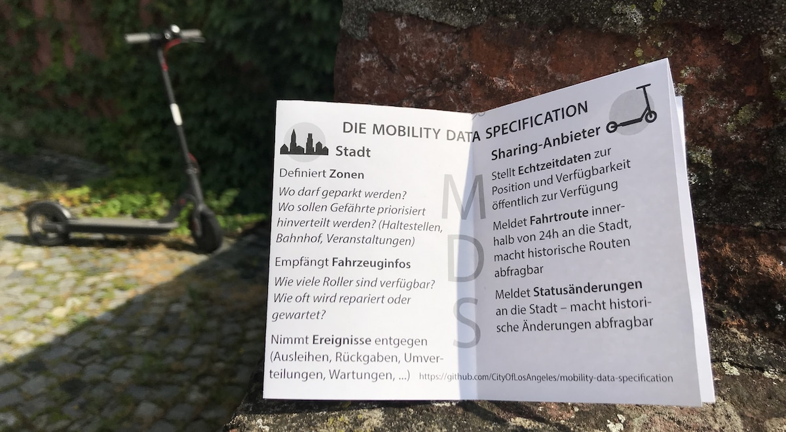
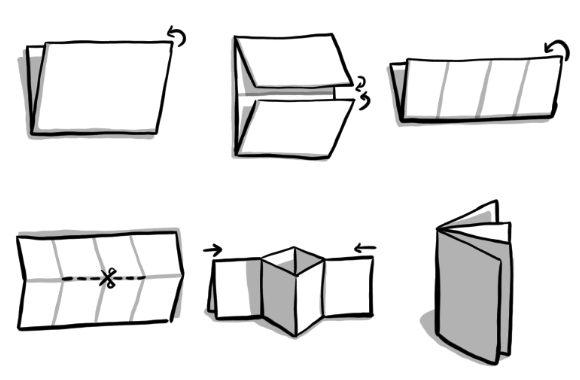

Wir haben die Erfahrung gemacht, dass Leute nach etwas Erklären die [Mobility Data Specification (MDS) und ihre Vorteile](/log/mds-fuer-kommunen-erklaert/) durchaus verstehen - aber dieses Wissen selbst weitertragen ist dann nicht ganz einfach. Da bei der Einführung der MDS durchaus mehrere städtische Stellen beteiligt sind, können kleine Erklärungshilfen unglaublich hilfreich sein.

<figure>
	
</figure>

Das Ergebnis ist im Format eines [Zines](https://en.wikipedia.org/wiki/Zine) und hat 8 Seiten. Entdeckt haben wir dieses Format bei [Julia Evans (@b0rk)](https://twitter.com/b0rk), die in ihrem Post [How (and why) I made a zine](https://jvns.ca/blog/2016/08/29/how-i-made-a-zine/) zeigt, warum es super für Erklärungen ist und [bleeptrack](https://www.bleeptrack.de/projects/jugendhackt), die uns eine kleinere A7-Variante zeigte, die sich aus einer A4-Seite falten lässt.

&rarr; [MDS-Zine herunterladen (PDF, A4)](/log/mds-zine/mds-zine-radforschung.pdf) &larr;

<small>[CC BY 4.0](https://creativecommons.org/licenses/by/4.0/) radforschung</small>

[bleeptrack](https://www.bleeptrack.de) hat uns freundlicherweise auch eine Anleitung für die passenden Faltschritte dagelassen (Schere benötigt):

<figure>
	
</figure>
