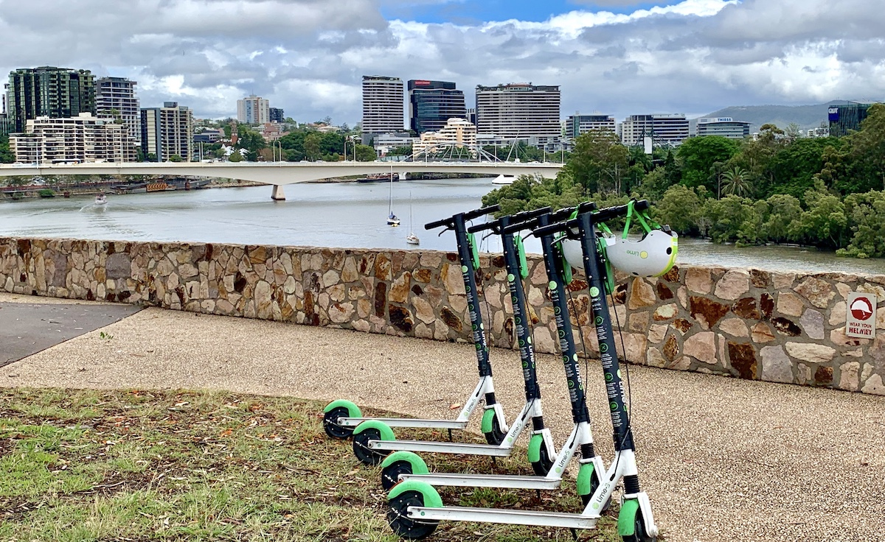
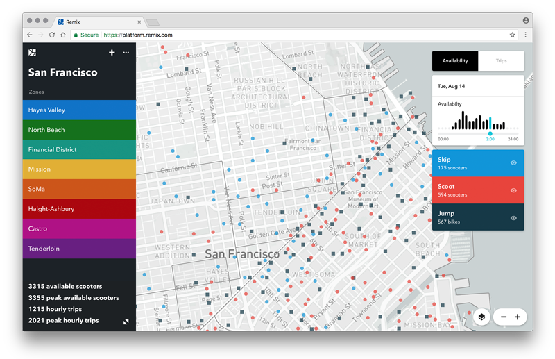

<figure>
  
  <figcaption>
    
<a href="https://commons.wikimedia.org/wiki/File:LimeBike_scooters_in_Brisbane,_Queensland.jpg">LimeBike scooters in Brisbane, Queensland</a> von Kgbo, <a href="https://creativecommons.org/licenses/by-sa/4.0">CC BY-SA 4.0</a>

  </figcaption>
</figure>

Es geht los. [Zahlreichen](https://www.heise.de/newsticker/meldung/Elektrokleinstfahrzeuge-Erlaubnis-fuer-E-Tretroller-soll-dieses-Jahr-kommen-4311588.html) [Medienberichten](http://www.spiegel.de/auto/aktuell/elektromobilitaet-freie-fahrt-fuer-elektro-skateboards-a-1253434.html) [zufolge](https://www.zeit.de/mobilitaet/2019-02/e-scooter-elektroboards-gesetz-erlaubnis-verkehrsmittel-elektromobilitaet) soll die Verordnung für die Benutzung von Tretrollern und Skateboards mit Elektromotor auf deutschen Straßen in den nächsten Wochen endlich kommen.[^1] Und gleichzeitig stehen auch schon einige Shared-Mobility-Dienstleister in den Startlöchern. Bird und Lime aus den USA, aber auch europäische Startups wie Voi, Wind und Tier wollen ihre Fahrzeuge in vielen deutschen Städten ausrollen. Die Elektro-Tretroller stehen am Wegesrand im öffentlichen Raum und können per App entsperrt und für ein geringes Entgelt benutzt werden – sofern man die passende App heruntergeladen und vorab ein wenig Geld aufgeladen hat. Es bleibt aber nicht nur bei einer Ankündigung der Anbieter, auf den einschlägigen Job-Seiten drängen diese bereits aktiv dazu Stellen wie _"City Manager - Stuttgart"_[^2] und _"Country Manager - Germany"_ zu besetzen.
Die _Elektrokleinstfahrzeuge_ kommen also. Wie schnell diese nach Inkrafttreten der Verordnung in deutschen Städten auf den Gehwegen stehen wird sich zeigen – aber was können deutsche Städte von anderen lernen, die das erste Scooter-Hoch schon hinter sich haben?

### Nicht alle Städte müssen die selben Schmerzen wiederholen

Neben San Francisco[^3], Paris[^4], Brüssel und Wien hatten viele andere Städte in den letzten Monaten plötzlich Roller auf ihren Gehwegen stehen[^5]. Und das meist nicht nur von einem Anbieter – gleich mehrere von ihnen versuchen mit möglichst vielen Fahrzeugen vorbeilaufende Menschen von ihren Rollern zu überzeugen. All diese Städte haben – oder hatten – auch die damit verbundenen Schmerzen zu spüren bekommen. Genervte Anwohnende und Eltern mussten mit Kinderwägen oder dem Rollstuhl einen Slalom um auf dem Gehsteig geparkte Scooter navigieren. Fahrradständer wurden zur Leihroller-Abstellstation umfunktioniert und boten keinen Platz mehr für ihren eigentlichen Zweck. Und wenn die Scooter verdreckt, kaputt oder mehrere Tage mit leerem Akku herumstehen, werden diese auch von niemanden mehr durch die Stadt bewegt.



Letztendlich erzeugen solche Situationen nur unnötig Frust über ein spannendes, neues Verkehrsmittel. Man fühlt sich etwas an das *oBike*-Desaster in München erinnert: Dort führten 8.000 Sharing-Fahrräder, ein vorschneller Launch und ein unpassendes Betriebsmodell dazu, dass Räder kaputt herumstanden, in Flüssen landeten und der Betreiber untertauchte. Derweil können Städte – besonders in Deutschland – durchaus Impulse gebrauchen, um endlich die Dominanz des massenhaften Individualverkehrs per Auto zu brechen. Ob Leih-Scooter ein *nötiges* Puzzlestück in der Mobilitätswende sein werden, weiß momentan noch niemand. Es wäre aber schade, das darin liegende Potenzial einfach ungenutzt verpuffen zu lassen.

### Regulierung durch Digitalisierung

Um aus dem Gemeingebrauch des öffentlichen Raums nicht die *Tragödie der Commons*[^6] werden zu lassen, könnten Städte regulierend eingreifen. Aber wie soll das aussehen, wenn der Scooter-Sharing-Anbieter gegenüber der Stadt wie eine "Black Box" auftritt? Wie soll diese kontrollieren, wie soll sie Feedback einholen und als Stadt lernen, wo infrastrukturelle Verbesserungen notwendig sind, die allen zu Gute kämen?

Auch aus langfristiger, städteplanerischer Sicht ist es sinnvoll, herauszufinden, wie die Verfügbarkeit von Rollern die Mobilität einer Stadt und ihrer Bewohner:innen beeinflusst. Dazu braucht es Daten!

Eine Echtzeitrückmeldung der vollständigen Mobilitätssituation einer Stadt gestaltet sich bereits mit den bisherigen Angeboten schwierig. Bei städtisch betriebenem ÖPNV mit Bus und Tram scheitert eine Auslastungsmeldung meist an technischen und betrieblichen Gründen, bei Carsharing und dem Privatauto-Verkehr passiert die Erfassung nur an einzelnen, festinstallierten und teuren Zählstellen. Die Erfassung des Fahrradverkehrs, die erst auch als Vorlage für den Rollerverkehr sinnvoll erscheint, passiert auch nur vereinzelnd durch Stichproben mittels Studierenden oder Renter:innen mit Klickern in der Hand. Dies ist alles nicht zukunftsweisend und erschwert die Erfassung und Analyse der Situation. Lägen kontinuierlich erfasste Daten vor, ließen sich beispielsweise die Auswirkungen zeitweiser Straßen- oder Brückensperrungen auf das Gesamtsystem analysieren – derzeit ist Verkehrspolitik in Städten stattdessen vor allem meinungs- und gefühlsgetrieben. Eine forschungsgetriebene, experimentelle Herangehensweise an mögliche Fragestellungen ist dagegen nicht umsetzbar. Dabei geht es auch anders: durch die bereits stark technologisch und datengetriebene Arbeitsweise der Anbieter eröffnet sich auch eine Chance für bessere Verkehrsplanung und -Steuerung in der Stadt.

Die City of Los Angeles hat einfach einmal ausprobiert, wie sie zumindest einen Teil solcher Daten aus der Privatwirtschaft einfordern kann. Und zwar auf eine sehr faszinierende, nutzerzentrierte und für eine Stadt auch als "gelebte Digitalisierung" anzusehende Art. Zusätzlich zur klassischen Regulierung, wie viele Roller ein Anbieter platzieren darf, wie sie abgestellt werden dürfen und vor allem wo nicht[^7], gab das LA Department of Transportation über digitale Tools und Infrastruktur auch einen technischen Rahmen für die Umsetzung vor. Sie erstellten die erste Version der [**Mobility Data Specification**](https://github.com/CityOfLosAngeles/mobility-data-specification) (MDS). Das ist ein technischer Standard, der beschreibt, welche Daten in welchem Format die Betreiber der Stadt zur Verfügung stellen müssen, und wie die Stadt im Gegenzug ebenenfalls maschinenlesbare Regeln bereitstellt.



Die Stadt reguliert Zonen, in denen Scooter abgestellt werden dürfen, nämlich nicht als Liste von Ortsbeschreibungen oder gar PDF-Karten mit reingemalten Gebieten. Stattdessen sind die Zonen als maschinenlesbare Geodaten bereitgestellt, die automatisiert verarbeitet werden können. Zudem beschreibt die Spezifikation auch eine Schnittstelle für die Betreiber, über die jedes Gefährt vor Inbetriebnahme bei der Stadt registriert wird. Einmal registriert, werden die aktuellen Zustände der Fahrzeuge in Echtzeit übermittelt. Ausleihen oder Aufladungen, vorübergehende Außerbetriebnahmen der Roller für technische Wartungen etc. werden auch zurück an die Stadt kommuniziert.

All das ermöglicht den Betreibern ein besseres Nutzererlebnis zu bieten – und der Stadt eine schnelle und einfache Möglichkeit die Einhaltung der Regeln zu prüfen und planbare, aber auch unvorhersehbare Ereignisse wie z.B. Straßen/Gehwegsperrungen oder Verlagerungen aufgrund Veranstaltungen ohne Mehraufwand an alle Sharinganbieter zu melden.

Zudem wird hier den Städten zum ersten Mal ein sehr einfacher Zugriff auf *Echtzeitdaten* und Statistiken zur Auslastung, Verteilung und somit zum Mobilitätsverhalten ihrer Bewohner:innen ermöglicht.

Dies beinhaltet auch, ein Auge darauf haben zu können, dass Scooter bevorzugt in Bereichen zur Verfügung stehen, die bislang nicht oder schlecht an den städtischen ÖPNV angebunden sind. Das ermöglicht Eingreifen in die Verteilung, weg von den "goldenen Innenstädten" und Touristenattraktionen und mehr Fokus in die Gebiete, an den Bewohner:innen bislang benachteiligt sind.

### Gemeinsam entwickeln, gemeinsam erforschen

Es zeigt sich auch hier wieder der positive Effekt, einer offenen, nachnutzbaren Entwicklung zusammen mit der Community: Die Mobility Data Specification (MDS) wurde gemeinsam von Menschen aus der Stadtverwaltung, von Verkehrsplaner:innen und mit Feedback von den Sharinganbietern entwickelt. Zudem stellen einige Städte wie Santa Monica oder Austin [ihre eigenen Tools zur Entgegennahme und Auswertung der Daten](https://github.com/CityOfLosAngeles/mobility-data-specification#related-projects) auch wieder offen und frei zur Verfügung, so dass diese von anderen Städten ohne aufwendige Neuentwicklung wiederverwendet werden können.

Durch diese Veröffentlichung lässt sich auch für Städte, bei denen der Start eines Scooter-Sharers bevorsteht, recht schnell und ohne große Entwicklungsmittel die benötigte Infrastruktur aufstellen, um die MDS zu implementieren und mit LA gleichzuziehen.
So bleibt es nicht nur bei der mehr oder weniger effektiven Regulierung der physischen Infrastruktur - es werden von Beginn an auch digitale Kontroll- und Verbesserungsmöglichkeiten geschaffen.

Eine obligatorische Open-Data-Strategie ermöglicht auch hier wieder Innovation vor Ort - zum Beispiel die Einbindung in Nahverkehrsapps (auch die der lokalen Stadtwerke/Verbünde!) – für ein Routing auf der letzten Meile, oder der Darstellung von in der Nähe befindlichen Mobilitätsangeboten an öffentlichen Plätzen oder Mobilitäts-Hubs, in Geschäften, Büros oder an der Touristeninformation.

Durch den offenen, technisch nicht sonderlich anspruchsvollen Standard und die dabei entstehenden offenen Daten können Fragen, die sich die Stadtverwaltung stellt oder Auswertungen, die der Rat gerne sehen möchte, erstmals auch inhouse entwickelt werden. Besteht in der städtischen Entwicklungskompetenz noch Nachholbedarf, muss die Auswertung nicht spezialisierten, alteingebackenen Dienstleistern überlassen werden - sondern kann auch an beliebige Freelancer vergeben werden. Ein Vendor-Lock-In, wie es bei bisheriger Betriebs- und Verkehrsplanungssoftware üblich ist, lässt sich hier durch offene Schnittstellen, Daten und Standards unterbinden.

Ein Beispiel für nutzerzentrierte Auswertungen und sind hier die [neuartigen Verkehrsplanungstools von Remix](https://www.remix.com/new-mobility) (einer Ausgründung aus [Code for America](https://www.codeforamerica.org/blog/2014/07/07/transitmix-design-your-perfect-bus-system/)). Diese können diese Daten bereits beziehen und sie nutzerfreundlich der Verwaltung und Ordnungsbehörde zugänglich machen.

[Portland](https://www.portlandoregon.gov/transportation/78431) kann als Vorbild bei der Auswertung der Daten genannt werden. Aus den Daten sowie Nutzer:innenbefragungen entwickelten sie den sehr lesenswerten, öffentlichen [2018 E-Scooter Findings Report](https://www.portlandoregon.gov/transportation/article/709719) und zeigten darin u.a., dass 34% der Einwohner und 48% der Besucher einen Scooter anstatt das eigene Auto oder Uber, Lyft, oder ein Taxi nutzten.[^8]

### Jetzt ist die Zeit dafür

Die deutschen Städte haben es in der Hand. Die Zeit dafür ist nicht mehr üppig, aber noch könnten die Stadt- und Gemeinderäte die oben beschriebenen Erkenntnisse und Ansätze in passende Satzungen und Verordnungen umsetzen, bevor die Sharing-Anbieter ihre Produkte in der Breite ausrollen. Das könnte im Rahmen größerer Open-Data- und Informationsfreiheits-Beschlüsse passieren – schließlich ist Mobilität nicht das einzige Themenfeld, in dem Städte die Offenheit passender Daten privatwirtschaftlicher Akteure zum Wohle der Allgemeinheit verbindlich fordern könnten. Aber auch für sich stehend würde es sich lohnen, dem Beispiel der City of Los Angeles zu folgen – allein schon, um nicht ähnlich überrumpelt und hilflos zu wirken, wie das beim Start des Leihradbooms in Deutschland passierte.

Wir sind gespannt, welche Kommunen in Deutschland bereit sind, hier gemeinsam eine Vorlage zu liefern.

**tl;dr**: Scooter-Sharing-Anbieter stehen in vielen deutschen Städten in den Startlöchern. Mit der Übernahme des Vorgehens und der Mobility Data Specification aus Los Angeles, erhalten Städte Echtzeit-Einblick auf die Scootersituation und können verhältnismäßig regulierend eingreifen - eine Reaktion auf Feedback und nötige Infrastukturverbesserungen sind aber auch dringend notwendig. Das bringt uns in der Mobilitätswende wieder ein Stückchen nach vorn.

[^1]: Der Gesetzgebungsprozess war leider mal wieder alles andere als transparent. Es kamen mehrmals Entwürfe an die Öffentlichkeit, deren Überregulierung starken Gegenwind erzeugten, Anfragen nach dem IFG wurden abgelehnt, stattdessen passierten durchstiche an Blogs. Zudem wurde bekannt, dass ausgerechnet im _Kleinst-_ Mobilitätsbereich wieder Gespräche mit BMW und anderen Autoherstellern passierten.
[^2]: VOI jobs page, https://web.archive.org/web/20190218171225/https://jobs.voiapp.io/jobs abgerufen am 2018-02-18
[^3]: https://www.theguardian.com/technology/2018/apr/17/san-francisco-electric-scooter-schemes-backlash-cease-desist
[^4]: https://www.bbc.com/news/av/world-europe-46349747/the-electric-scooter-scheme-taking-over-paris
[^5]: https://www.vox.com/2018/8/27/17676670/electric-scooter-rental-bird-lime-skip-spin-cities
[^6]: https://twitter.com/madeline/status/1026977578551103488
[^7]: http://clkrep.lacity.org/onlinedocs/2017/17-1125_rpt_DOT_06-22-2018.pdf
[^8]: https://www.portlandoregon.gov/transportation/article/709777