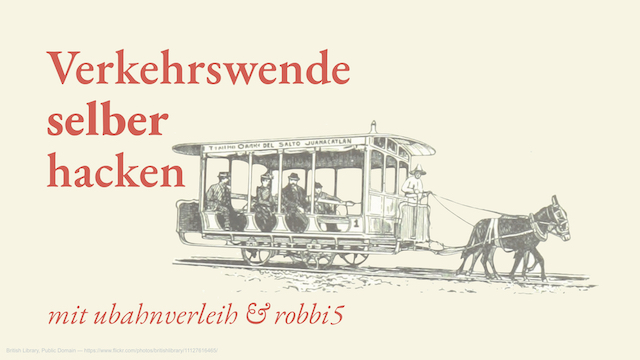

Auf dem 36c3 hatten wir die wunderbare Gelegenheit, über **Verkehrswende selber hacken** zu sprechen. 
Eine gute Zusammenfassung gab es bereits [von Stefan Krempl bei Heise](https://www.heise.de/newsticker/meldung/36C3-Die-Verkehrswende-selber-hacken-4624862.html) -- dieser Post ist also mehr eine Linkliste zu vertiefenden Dingen und all die Sachen aus den Speakernotes, die es nicht auf die Bühne geschafft haben.

<iframe width="100%" height="394" src="https://media.ccc.de/v/36c3-10881-verkehrswende_selber_hacken/oembed" frameborder="0" allowfullscreen>
	
</iframe>

(Video bei [media.ccc.de](https://media.ccc.de/v/36c3-10881-verkehrswende_selber_hacken) und auf dem [offiziellen YouTube-Kanal](https://www.youtube.com/watch?v=WhgRRpA3b2c))

### Silicon Valley erfindet den Bus
<small>(dreist [geklaut bei stk](https://stefan.bloggt.es/2019/05/wie-staedte-die-mobilitaet-der-zukunft-gestalten/), danke)</small>



* https://lifehacker.com/lyft-s-new-shuttle-service-is-more-convenient-than-lyft-1796167137
* https://www.pcmag.com/commentary/359462/silicon-valley-reinvents-the-bus
* https://www.stanforddaily.com/2018/04/09/when-silicon-valley-accidentally-reinvents-the-city-bus/
* https://thenextweb.com/us/2017/06/20/why-is-everyone-so-mad-that-lyft-shuttle-is-like-a-bus-service/
* https://www.businessinsider.com.au/lyft-shuttle-public-transit-bus-2017-7

### Man kann sich auf private Mobilitätsanbieter nicht verlassen

* https://www.swp.de/suedwesten/staedte/ulm/car2go-macht-in-ulm-dicht-pilotstadt-war-zu-klein-und-zu-teuer-21629207.html (car2go verlässt ulm, 2014)
* https://www.share-now.com/ca/en/important-update/ (car2go macht in ganz Nordamerika dicht, 2019)

Wir nennen das entstandene Prinzip gern den *Google Reader-Effekt* - da Leute in Ulm auch 5 Jahre später immer noch car2go hinterhertrauern und es wirklich eine Lücke hinterlassen hat, die niemand bislang richtig sinnvoll gefüllt hat, ähnlich wie bei Feedreadern.

### Nextbike-Sicherheitslücke

Auf der [GPN](https://entropia.de/GPN19) konnten wir die Schlösser der neuen Fahrrad-Generation von Nextbike öffnen. Sie benutzen das [selbe Schloss, das wir hier schonmal zerlegt haben](../schloss-von-innen-j/). Das Schloss ist eigentlich eine [Smartwatch](../schloss-am-handgelenk/). Wichtigste Message: **Ändert die voreingestellten Keys** und schaltet die Bluetooth-Schnittstelle ab, wenn ihr sie nicht nutzt (besonders dann, wenn man vorhat 6000 Räder damit auf die Straße zu bringen).

Der Talk ["Taking Bluetooth lockpicking to the next level ...or the 37th floor of a Hotel"](https://media.ccc.de/v/Camp2019-10241-taking_bluetooth_lockpicking_to_the_next_level) von mh und ray auf dem cccamp19 zeigt, dass diese Schlossfirmware ist noch in anderer Hardware ausser Fahrradschlössern verbaut ist.

### Wo sind Verkehrsmittel?

* Standorte veröffentlichen mit der [General Bikeshare Feed Specification (GBFS)](https://github.com/NABSA/gbfs), sie lässt sich auch für Scooter oder Carsharing benutzen.
* Dokumentation der (closed) Bike/Scootersharinganbieter-APIs: https://github.com/ubahnverleih/wobike

### Voi

Auf der Suche nach APIs für WoBike ist uns eine offene Kundendatenschnittstelle aufgefallen.

Medienberichte:

* https://www.br.de/nachrichten/netzwelt/datenpanne-bei-start-up-voi,RL5Hb5R
* https://nrkbeta.no/2019/03/19/sparkesykkel-appen-voi-lagret-persondata-om-nordmenn-apent-pa-nettet/

### Visualisierungen

Mit den Daten aus der MDS - oder eigens berechneten Routen zwischen den öffentlich sichtbaren Positionen ausleihbarer Räder und Roller lassen sich Visualisierungen bauen, um die Mobilitätsnutzung besser zu verstehen:

* [Visualisierung: E-Scooter-Fahrten in Dresden](../vis-scooter-dresden/)
* https://bikesharing.citylab-berlin.org

### MDS und Policy selber machen

Der [Technology Action Plan des LADOT](https://ladot.io/wp-content/uploads/2019/03/LADOT-TAP-v7-1.pdf) (pdf, 29 Seiten) und die [Transportation Technology Strategy](https://ladot.io/wp-content/uploads/2019/01/TransportationTechnologyStrategy_2016.pdf) (pdf, 271 Seiten) beschreibt gut die Herangehensweise des Los Angeles Department of Transportation und wie sie folgerichtig zur MDS kamen.

* Kurzes MDS-Einführungsvideo: https://www.youtube.com/watch?v=FpGboFSSddo
* https://github.com/openmobilityfoundation/mobility-data-specification
* Unsere Posts zur MDS: [MDS für Kommunen, erklärt](../mds-fuer-kommunen-erklaert/), [MDS-Zine](../mds-zine/), [Mobility Data Specification-FAQ aus Kommunalsicht](../mds-faq/)

Unsere Suche nach Städten, die davon profitieren könnten, zu wissen, dass die MDS existiert, haben wir in [Rollersharing: diese Anbieter wollen in die Städte](../roller-in-die-staedte/) dokumentiert. Einige haben die MDS dann auch in ihrere Forderungen aufgenommen:

* MDS Ulm: https://github.com/stadtulm/mds-zonen
* MDS Hamburg: https://www.hamburg.de/contentblob/12739712/7242056ae13651f702172cbc2adb4281/data/2019-06-20-plev-vereinbarung-hamburg-final.pdf
* NRW: https://www.zukunftsnetz-mobilitaet.nrw.de/infothek/aktuelles/tretroller-sharing-neues-beratungsangebot

Für eine genauere Übersicht, welche Städte Scooteranbieter jetzt wie regulieren, werden wir noch einen gesonderten Blogpost bauen.

### Mobilität einfacher machen

* [digitransit](https://digitransit.fi), ein Open Source ÖPNV-Auskunfts-Stack. [Original aus Helsinki](https://reittiopas.hsl.fi). Es gibt bereits eine kleine, feine Entwicklercommunity, die bereits verschiendene Instanzen aufgesetzt hat: [Verschwörhaus (Ulm)](https://digitransit.im.verschwoerhaus.de), [Herrenberg](https://mobil-in-herrenberg.de), [Münster](https://digitransit.codeformuenster.org), [Osijek](https://cityrouting.e-gpp.hr), [Oulu (Entwicklungsvorschau)](https://next-dev.oulunliikenne.fi) (eigene UI-Anpassungen, Integration von Traffic-Cams, Fahrradzählern und Straßen/Radweg/Fußwegstörungen)
* [Mitfahrdezentrale](http://www.mitfahrdezentrale.de) mit [mitfahren-bw](http://mitfahren-bw.de), um Mitfahrangebote wie einen Fahrplan zu behanden und so in Routingsysteme einfließen lassen zu können.
* [Alexeys Fehlende Busse](https://twitter.com/orless/status/1204108182806843394), um aufzuzeigen, welche Orte mit einer Buslinie besser an den Schienennahverkehr angebunden werden könnten.
* [RetteDeinenNahverkehr.de](https://rettedeinennahverkehr.de) um bislang fehlende offene Daten zu Fahrplänen etc. einfach anzufragen.
* [OpenData der Bahn](https://data.deutschebahn.com) - Leider ohne Fahrplandatensatz (nur als [API](https://data.deutschebahn.com/dataset/api-fahrplan), sodass Leute [das bei jedem Fahrplan abgrasen müssen](https://github.com/fredlockheed/db-fv-gtfs)). [Schreibt](https://betatestplattform.noncd.db.de/feedback) gern dem Open Data Team, dass ihr das gern hättet.

### Open Data muss offen sein, Mobilitätsdaten auch

Carsharer behaupten bislang, die Positionen ihrer gerade ausleihbaren Autos wären ein Geschäftsgeheimnis - und bieten daher APIs nur gegen exorbitante Summen an bzw. sichern die APIs, die sie in ihren Apps verwenden sogar noch besonders ab.

Unsere Forderung: **Wer Mobilität anbietet muss Daten bereitstellen**.

Bis diese Forderung umgesetzt ist, landet API-Doku bei [WoBike](https://github.com/ubahnverleih/wobike) und gescrapte Daten auf https://transitbay.org.

Zudem gilt: Kein Urheberrecht auf Faktendaten. Auch nicht auf Fahrpläne. Zu diesem Schluss kommt auch der [Abschlussbericht des Forschungsvorhaben 70 825 „Eigentums- und Nutzungsrechte im öffentlichen Verkehr“](https://fragdenstaat.de/anfrage/abschlussbericht-forschungsvorhaben-nr-70825-eigentums-und-nutzungsrechte-im-offentlichen-verkehr/82918/anhang/FoPS_70825_AbschlussbeNAME.pdf), das im Rahmen des Forschungsprogramm Stadtverkehr ([FoPS](https://de.wikipedia.org/wiki/Forschungsprogramm_Stadtverkehr)) beim BMVBS vorgelegt wurde (das ist das Verkehrsministerium, das heute BMVI heißt).

### Gegenentwurf: Bikesharing selber machen

_Willkommen bei radforschung.org._ Eigentlich wären jetzt Links auf alle bisherigen Posts sinnvoll, aber hier ist eine kurze Auswahl:

* Das Problem, die Grundidee und Motivation in [Bikesharing, selbstgemacht](../bikesharing-selbstgemacht/).
* Der [Aufruf fürs Camp](../bikesharing-cccamp19/) und die [Nachbetrachung und was wir gelernt haben](../cccamp19-review/)
* Die Fortführung als [OpenBike](https://ulm.dev/projects/openbike/) bei der Stadt Ulm, gefördert vom Ministerium für Verkehr Baden-Württemberg.
* Jetzt bereits laufender Code dafür: [cykel als Serversoftware/API](https://github.com/stadtulm/cykel) und [voorwiel als Frontend](https://github.com/stadtulm/voorwiel), sowie die [adapter für tracker](https://github.com/stadtulm/cykel-ttn) ([auch mit wifi](https://github.com/stadtulm/cykel-ttn-wifi ))

**Bikesharing wirklich selber machen**: Setzt die Software gerne selber auf (für deine Kommune, deinen Hackspace, deinen Tourismusverein?), besorgt euch Räder und schickt uns Probleme die ihr bemerkt habt oder Ideen dafür gerne als Issue bei GitHub. 

Wichtig ist uns dabei: durch öffentliches Fördergeld entwickelte Software muss Open Source sein. Dazu auch die Kampagne [Public Money, Public Code](https://publiccode.eu).

### Mobilität sichtbarer machen

Damit (öffentliche) Mobilität wieder ernstgenommen, mehr gefördert und vorallem ausgebaut wird, sehen wir, dass sie sichtbarer werden muss - auch wenn diese Sichtbarkeit bedeutet aufzuzeigen, dass in einem Dorf nur zweimal am Tag ein Bus kommt (und das zu wenig ist).

Dafür eignen sich z.B. die [selbstbaubaren Nächster-Bus-in-Panels](https://github.com/d3d9/dm_tomatrixled) von [@cabinentaxi](https://twitter.com/cabinentaxi), [digitransit](https://digitransit.fi) aus Helsinki und das Anfragen von Mobilitätsdaten über [RetteDeinenNahverkehr](https://rettedeinennahverkehr.de).

### Folienmalen:

Ein ganz ganz fettes Shoutout geht an die [British Library](https://www.flickr.com/search/?user_id=britishlibrary) für die [Public Domain Scans von Strichzeichnungen aus sehr alten Büchern](https://www.flickr.com/search/?user_id=britishlibrary) und [rixx](https://rixx.de), der mit [diesem Blogpost](https://rixx.de/blog/advice-for-a-bad-speaker/) zum Stil inspiriert hat.

Ein bisschen geholfen, unsere Gedanken zur recht vielfältigen Mobilitätsbubble zu sortieren, hat erstmal alles auf Zettel aufzuschreiben:



Danke an 

* [Holman](https://twitter.com/holman)s [speaking.io](https://speaking.io) und der [Talk on Talks](http://zachholman.com/talk/the-talk-on-talks/) die nochmal rechtzeitig daran erinnert hat, eine Outline zu bauen um so eigentlich herauszufinden, welche Punkte wir immer und immer wieder setzen wollten (aber keine ahnung ob das geklappt hat und auch so angekommen ist)
* [Juka](https://twitter.com/gruenzeug), [Simon](https://twitter.com/semapher) und [stk](https://twitter.com/_stk), die sich in der Konzeptionsphase viel Zeit für Feedback, Support und Verbesserungen genommen haben (und auch erfolgreich aus einer fuck-this-shit-talk-einfach-sein-lassen-Panik rausgeholt haben)
* Unser Testpublikum, das sich extra spät in der Nacht an Tag 2 und Tag 3 bei der WikiPaka-WG-Bühne die Zeit genommen habt, sich unsere Entwurfsfassungen anzuhören und wirklich gutes Feedback zu geben.



* Die ErsteReiheOpenDataPöbelGang, die neben wunderbarem Support auch durch strategisches Mitsingen den Prinzen-Gag (*Alles nur gekauft, eh jo*, ab Minute 12:55) nicht zu einer komplett awkwarden Situation abdriften haben lassen 🙃
* und Sorry und Danke an all die Menschen die wir in der Auflistung vergessen haben.

### Dinge, die es nicht mehr in den Talk geschafft haben

Hier noch ein paar Dinge, die es as Zeitgründen nicht mehr in den Talk geschafft haben, oder die wir vergessen haben:

* Die [Delegierte Verordnung 2017 / 1926](https://eur-lex.europa.eu/legal-content/DE/TXT/?uri=CELEX%3A32017R1926), die offene Mobilitätsdaten (im ersten Schritt Sollfahrpläne etc.) erzwingt. [Im zweiten Schritt ab Dezember 2020 gehören auch Carsharing, Carpooling, Bikesharing und Co dazu](http://sfmcon.dk/2019/12/02/in-12-months-only-all-demand-responsive-transport-drt-modalities-in-the-eu-shall-publish-open-mobility-data-through-the-national-access-points-nap/) – in Deutschland lobbyieren Carsharer aber dafür, sie von dieser Regulierung auszunehmen.
* Wenn man sich registrieren muss, ist es kein Open Data. Looking at you, _Connect-Fahrplan Portal_ und "opendata-oepnv.de". Nur weil man „Open“ dranschreibt, entspricht es nicht der [Open Definition](http://opendefinition.org). Looking at you, sogenannter [„OpenService“](https://www.vdv.de/schriften---mitteilungen.aspx?id=8e82cea0-0d28-46e1-b578-6c2a15f2f238&mode=detail) des VDV. Open heißt diskriminierungsfrei, für alle zugänglich, für alle Zwecke verwendbar, und unter freier Lizenz – falls eine Lizenz überhaupt statthaft ist und es sich nicht ohnehin um gemeinfreie Faktendaten handelt, was regelmäßig der Fall sein dürfte.
* Falls ihr selber Dienste, Webseiten, whatever Betreibt: Stellt eure Daten zur Verfügung, stellt APIs bereit und dokumentiert sie. Menschen werden coole Sachen damit machen! Ihr _braucht_ auch keine API Keys. Fahrt im Zweifel zweigleisig und stellt auch einen restriktionsfreien Zugang auf Best-Effort-Basis hin.

----

Wir freuen uns weiterhin über Feedback, Ideen und Anregungen zum Talk. Gerne einfach per [Twitter oder Mail](../about/).

